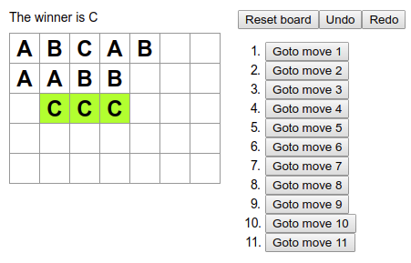

# extensible-react-tic-tac-toe

A customizable tic tac toe built on React. You can customize:

1. the size of the board.
2. the number of players on the board and their symbols.
3. the number of consecutive strokes required to get a win.

Additional features include a complete move history table, wherein you can undo/redo the moves, goto a specific move in the history, as well as a neat highlight indicating when a player won.

A custom view of the extensible tic tac toe:

Special thanks to [Create React App](https://github.com/facebook/create-react-app) for helping me focus on the code and abstracting away the initial setup of the localhost server and dependencies! Also to the introductory reactjs.org tutorial for the index.css files!
